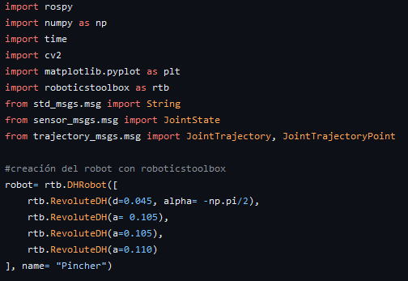
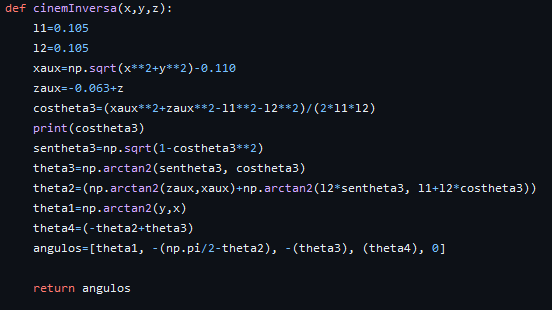
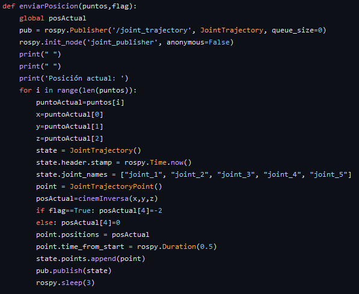
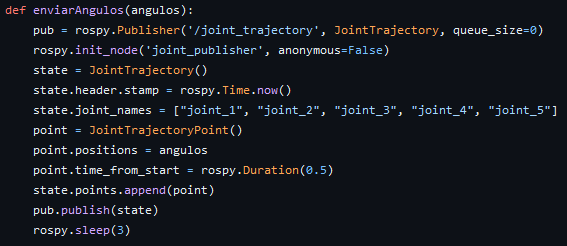
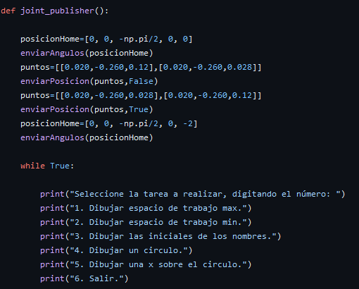
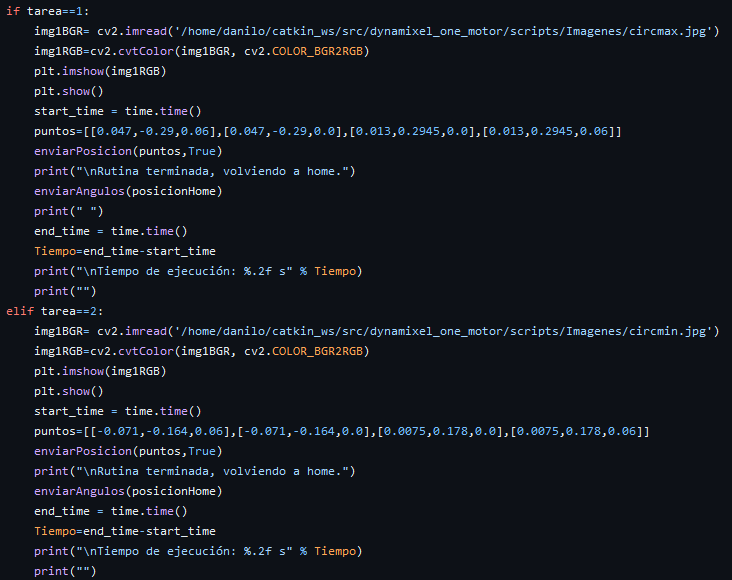

# Laboratorio 5 Robótica
## Integrantes: 
- Danilo Enrique Insuasty Delgado.
- Abraham Másmela Ramirez.
- Nicolás Prieto Solano.
## Descripción
Se busca desarrolar el modelo cinemático inverso del Phantom X e implementar rutinas de escritura que el usuario debe elegir.
## Objetivos:

• Determinar el modelo cinemático inverso del robot Phantom X. 
• Generar trayectorias de trabajo a partir del modelo cinemático inverso del robot. 
• Implementar el modelo cinemático inverso del robot en MATLAB o Python. 
• Operar el robot usando ROS a partir de trayectorias generadas en MATLAB o Python. 

## Desarrollo:
### Cinemática inversa

### Trayectorias
Para las trayectorias en primer lugar se realizó un dibujo del espacio de trabajo utilizando Dynamixel wizard, se tomaron medidas y luego se trazaron dos circulos con estas dimensiones en Autocad, para determinar donde iban a estar ubicados los puntos de las figuras a realizar. 

Para la obtención de los puntos se colocó la ubicación de los puntos en autocad sobre las trayectorias de las figuras y se obtuvieron las coordenadas, que posteriormente se pasaron a python como una lista de vectores con tres coordenadas (x,y,z) y las coordenadas z se modificaron manualmente de tal forma que cuando estaba dibujando Z era cero y cuando habia un salto en la trayectoria se aumentaba Z para que el marcador no dibujara.

Para las letras se tomaron los puntos, para el circulo se tomo una posición y a partir de ella con una función se trazo un circulo aumentando el angulo gradualmente, las figuras se pueden ver en la siguiente imagen

<h2>Código</h2>

Al iniciar el codigo se importan las librerias necesarias, siendo estas rospy para el manejo de ROS, numpy para operaciones numericas, rtb para la creacion del modelo matematico del robot y distintos topics de mensajes para la comunicacion con el manipulador pincher. Luego se crea el modelo de DHstd del robot pincher mediante la libreria std, definiendo las 4 articulaciones que posee el manipulador.

En la cinematica inversa se definen las longitudes del robot junto unas variables auxiliares con valores que se usan repetidamente durante la funcion, los valores de las distintas articulaciones esta dado en terminos de arcotangentes empezando por el valor del angulo de la tercera articulacion, siguiendo el calculo de la segunda y de la primera, acabando finalmente con la cuarta articulacion siendo esta la que no fue resuelta de manera geometrica. Estos valores son devueltos como una lista.

Se crea la funcion encargada de enviar distintas posiciones al controlador del manipulador, se crea el objeto publisher que pasara los mensajes al pincher y se inicia el nodo de ROS que comunica al codigo de python, en un ciclo for que itera en la lista de puntos que se ingresan como parametros iniciales, se separa cada punto en sus coordenadas X, Y y Z. Se crea el objeto state que sera el mensaje publicado y el objeto point que correspondera a uno de los puntos de ntro de la JointTrajectory, en la variable posActual se guardan los valores de las artiuclaiones que son obtenidas mediante la funcion de cinematica inversa ya descrita, la posicion actual se añade a la variable de point y esta misma se anexa a la variable state que es publicada mediante el publisher ya creado, finalmente se suspende el programa brevemente para dar tiempo al pinche a ejecutar la instruccion.

Similar a la funcion anterior se crea el elemento de publisher con el topi c de JointTrajectory, junto con el mensaje state de topic JointTrajectory, se inicializa el nodo de ROS y crea el objeto point de la clase JointTrayectoryPoint, a este ultimo se anexan los angulos que se reciben como parametros de entrada a la funcion, y este mismo se anexa al objeto state que es posteriormente publicado mediante el publisher, dejando un tiempo para la ejecucion de los comandos.

Se establece un posicion de home para el robot, sen envia a esta y luego mediante la funcion enviarPosicion se lleva al punto donde esta el marcador, este se recoje y luego se levanta para volver a la posicion de home. Se inicia un ciclo while que se mantendra activo siempre que el programa siga en ejecucion, pedira una entrada al usuario para definir la funcion a ejecutar, estas opciones son impresas mediante consola.

Para el desarrollo de distintas tareas se sigue un procedimiento similar, dentro de una lista de puntos se guarda el recorrido que debe de tener el marcador, con cada uno de estos puntos definido en sus coordenadas X, Y y Z, mandando la lista de los elementos de la trayectoria a la funcion enviarPosicion que se encarga del recorrido, cuando acabe este recorrido, el robot vuelve a la posicion de home mostrando por consola el tiempo de ejecuacion total.
## Conclusiones
